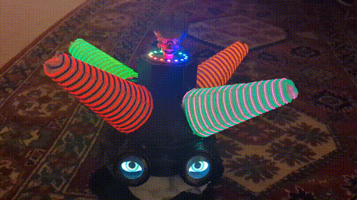
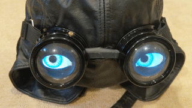
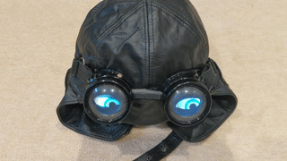

# ElectroHat
Mark3 Tin-Foil Hat

**WIP**

Mark3 hat with goggles:
  * first version: [LdgDisplay](https://github.com/jduanen/LdgDisplay)
  * second version: [PrcDisplay](https://github.com/jduanen/PrcDisplay)

Consists of two major components -- the Hat and the Goggles -- each of which can be operated in stand-alone mode and are interacted with via web interfaces.

## Hat

The Hat lights up the wires wrapping the cones in definable patterns and rates.

The Hat consists of:
  * four cones (each of which is wrapped in a pair of colored EL wires)
    - using laser-cut acrylic bars with regular indentations that the wires snap into
      * TODO: add models for these bars
  * eight colored EL wires
    - driven by an Alien Font Display driver card (https://github.com/jduanen/alienFontDisplay)
  * ESP32-C3 WiFi-connected controller that controls the EL wires and offers the Hat's web interface
    - use Arduino2 IDE
      * add url to board manager
        - https://raw.githubusercontent.com/espressif/arduino-esp32/gh-pages/package_esp32_dev_index.json
      * add ESP32 board package
      * select XIAO_ESP32C3
    
  * power supply consisting of
    - LiPo battery
    - battery charger: allows charging of battery (via USB connector) and generates 5V for the ESP controller
    - DC-DC converter: converts 5V from battery charger to 12V for HV AC PSU
    - high-voltage AC power supply: for the EL wires

## Googles

The Googles display animated eyes that can be ?

The Goggles consist of:
  * (steampunk-like) googles (with hemispherical lenses and masks)
    - https://www.adafruit.com/product/1577
  * pair of round LCD displays (Waveshare)
    - 240x240 IPS
    - 32.4mm display diameter (package: 37.5mm diameter, max 40.4mm)
    - 4-wire SPI interface
    - 3.3V and 5V
    - GC9A01 driver
    - Pinout
      * VCC: 3.3V/5V
      * GND: Ground
      * DIN: SPI Data In
      * CLK: SPI Clock In
      * CS: Chip Select (active low)
      * DS: Data/Command select (high=Data, low=Command)
      * RST: Reset (active low)
      * BL: Backlight
    - https://www.waveshare.com/product/displays/lcd-oled/lcd-oled-3/1.28inch-lcd-module.htm
    - https://www.amazon.com/Display-Arduino-Raspberry-240%C3%97240-Embedded/dp/B095X1JDCM/ref=sr_1_15?crid=1DDHRPORF8AHX&keywords=amoled+display+component&qid=1663625753&sprefix=amoled+display%2Caps%2C218&sr=8-15
    - https://www.waveshare.com/product/displays/lcd-oled/lcd-oled-3/1.28inch-lcd-module.htm
    - https://www.waveshare.com/wiki/1.28inch_LCD_Module
    - Waveshare library and example code:
      * wget https://www.waveshare.com/wiki/File:LCD_Module_RPI_code.zip
    - TFT_eSPI library and example code:
      * uses Adafruit GFX library
      * installed through Arduino IDE Library Manager
        - Arduino IDE -> Library Manger -> TFT_eSPI
      * copy Setup300_RP2040_GC9A01_SPI_240x240.h to ${HOME}/Arduino/libraries/TFT_eSPI/User_Setups
      * edit ${HOME}/Arduino/libraries/TFT_eSPI/User_Setup_Select.h
        - uncomment all other includes
        - add this line:
          * #include <User_Setups/Setup300_RP2040_GC9A01_SPI_240x240.h>  // Setup file for XIAO RP2040 and GC9A01 240 x 240 TFT using SPI
      * change all uses of "SCREEN_WIDTH" and "SCREEN_HEIGHT" to "EYE_WIDTH" and "EYE_HEIGHT"
    - Uncanny_Eyes application and eye table generation
      * git clone https://github.com/adafruit/Uncanny_Eyes.git
      * from convert/ copy defaultEye/, hextable.py, and tablegen.py
      * copy defaultEye/ to eye/
      * scale all images by a factor of 1.5
        - for f in *.png; do echo $f; convert -resize 150% $f $f; done
      * fix tablegen.py
        - ????
      * build eye.h file(s)
        - python3 tablegen.py eye/sclera.png eye/iris.png eye/lid-upper-symmetrical.png  eye/lid-lower-symmetrical.png eye/lid-upper.png eye/lid-lower.png 120 > eye.h
        - change all uses of "SCREEN_WIDTH" and "SCREEN_HEIGHT" to "EYE_WIDTH" and "EYE_HEIGHT"

  * XIAO RP2040 controller
    - install sdk and tools for RP2040
      * git clone https://github.com/earlephilhower/arduino-pico
      * follow install instructions
    - ARM M0+, dual-core, up to 133MHz
    - 264KB SRAM, 2MB Flash
    - UART, IIC, SPI, GPIO (11x), PWM, ADC (4x)
    - reset button and boot button, tricolor LED, RGB LED
    - 21x17.5mm
    - USB-C
    - 5V/3.3V
    - pinout
      * P26/A0/D0
      * P27/A1/D1
      * P28/A2/D2
      * P29/A3/D3
      * P6/SDA/D4
      * P7/SCL/D5
      * P0/TX/D6
      * RX/P1/CSn/D7
      * P2/SCK/D8
      * P4/MISO/D9
      * P3/MOSI/D10
      * 3V3: regulated output, <=700mA
      * GND: ground
      * 5V: output from USB port, can be used as input (requires diode)
    - compile and upload proc/home/jdn/Arduino/libraries/TFT_eSPI/User_Setup.sh:
      * doesn't work:
        - Arduino IDE 2.0: Sketch->Export Compiled Binary (Alt-Ctl-S)
        - hold B and press A until mount appears: /media/jdn/RPI-RP2
        - 'cp build/Seeeduino.rp2040.Seeed_XIAO_RP2040/\*.ino.elf.uf2 /media/jdn/RPI-RP2/NEW.UF2'
        - press and release A
      * works:
        - run arduino IDE 1.8.19
          * Navigate to File > Preference, and fill "Additional Boards Manager URLs" with:
            - https://github.com/earlephilhower/arduino-pico/releases/download/global/package_rp2040_index.json
          * Use Boards Manager to:
            - remove XIAO RP2040 package 2.7.2
            - install package 1.12.0
            - doesn't work:
              * upgrade the package to 2.7.2
                - add symlink to deal with misnamed directory
                  * pushd ${HOME}/.arduino15/packages/Seeeduino/hardware/rp2040/2.7.2/variants/
                  * ln -s Seeed_XIAO_RP2040 SEEED_XIAO_RP2040
            - remove Seeeduino package and use pico package instead
    - hookup
      * VCC: 3V3
      * GND: ground
      * DIN: 3
      * CLK: 2
      * CS:  1
      * DC:  6
      * RST: 7
      * BL:  0
  * XIAO ESP32-C3 controller
    - RISC-V single-core 32b CPU, up to 160MHz
    - 2.4GHz WiFi subsystem and BT5.0
    - 400KB SRAM, 4MB Flash
    - UART, IIC, IIS, SPI, GPIO (11x), PWM, ADC (4x)
    - reset button and boot button
    - 21x17.5mm
    - USB-C
    - 5V @ 200mA
    - pinout
      * GPIO2/A0/D0
      * GPIO3/A1/D1
      * GPIO4/A2/D2
      * GPIO5/A3/D3
      * GPIO6/SDA/D4
      * GPIO7/SCL/D5
      * GPIO21/TX/D6
      * GPIO20/RX/D7
      * GPIO8/SCK/D8
      * GPIO9/MISO/D9
      * GPIO10/MOSI/D10
      * 3V3: regulated output, <=700mA
      * GND: ground
      * 5V: output from USB port, can be used as input (requires diode)
    - https://wiki.seeedstudio.com/XIAO_ESP32C3_Getting_Started/
    - https://www.seeedstudio.com/Seeed-XIAO-ESP32C3-p-5431.html
    - https://wiki.seeedstudio.com/XIAO_ESP32C3_WiFi_Usage/
    - hookup
      * VCC: 3V3
      * GND: ground
      * DIN: 10
      * CLK: 8
      * CS:  3
      * DC:  4
      * RST: 5
      * BL:  6
  * LiPo battery and charger with USB interface

==============================================================================

Notes
* Uncanny Eyes
  - ESP32
    * https://www.hackster.io/laurentslab/halloween-skull-costume-with-uncanny-eyes-on-esp32-376a13
    * rendering takes ~6ms
    * ESP32 library has SPI.writePixels()
      - DMA and endianism-swizzle
    * 240x240 2B/pixel: 115,200 Bytes, 230KB for both displays
    * at 16MHz (divisor=5) SPI clock, ~72msec per display, ~14Hz
      - ~150ms (both displays) ~7Hz -- too slow, want ~20Hz
    * optimization opportunities:
      - overlap rendering and update
      - skip pixels that are still black (20-50% of the frame)
      - use both cores of the CPU
  - other links
    * uncanny eyes using ESP32 driving NTSC
      - https://github.com/Roger-random/esp_ntsc_eye
      - https://newscrewdriver.com/2021/05/03/putting-adafruit-uncanny-eyes-on-a-tube-tv/
    * Adafruit Monster M4SK
      - https://learn.adafruit.com/adafruit-monster-m4sk-eyes
    * M4 Eyes (2019)
      - two 240x240 LCD displays
      - 120MHz M4 CPU
      - libraries used:
        * Adafruit_Arcada
        * Adafruit_GFX
        * Adafruit_BusIO
        * Adafruit_ImageReader
        * Adafruit_LIS3DH
        * Adafruit_MSA301
        * Adafruit_NeoPixel
        * Adafruit_Seesaw
        * Adafruit_Sensor (Adafruit Unified Sensor in Library Manager)
        * Adafruit_SPIFlash
        * Adafruit_ST7789
        * Adafruit_TinyUSB
        * Adafruit_TouchScreen
        * Adafruit_ZeroDMA (Adafruit Zero DMA in Library Manager)
        * Adafruit_ZeroPDM (Adafruit Zero PDM in Library Manager)
        * Adafruit_ZeroTimer
        * ArduinoJson (not Arduino_JSON)
        * SdFat - Adafruit fork (not the standard SdFat fork)
        * Adafruit_AMG88xx (used by user_watch.cpp)
      - overclock, compile with -O3, use TinyUSB stack
      - https://learn.adafruit.com/pages/17050/elements/3037481/download?type=zip
    * halloween-skull-costume-with-uncanny-eyes-on-esp32 (2018)
      - ESP32, two 1.5" 128x128 OLEDs (SSD1351)
      - https://www.hackster.io/laurentslab/halloween-skull-costume-with-uncanny-eyes-on-esp32-376a13
    * Adafruit Hallowing M0
      - ATSAMD21, 1.44" 128x128 LCD, 8MB SPI flash
      - uses:
        * Adafruit_GFX
        * Adafruit_ST7735
      - https://learn.adafruit.com/adafruit-hallowing/
    * Uncanny Eye Pendant
      - ESP8266, 1.44" LCD display
    * TFT Animated Eyes
      - ESP32, two ST7735 128x128 displays, DMA
      - uses:
        * https://github.com/Bodmer/TFT_eSPI
      - https://github.com/Bodmer/TFT_eSPI/tree/master/examples/Generic/Animated_Eyes_2
      - https://www.instructables.com/TFT-Animated-Eyes/

* Libraries
  - TFT_eSPI
    * CPUs supported: RP2040, ESP32(-S2, -C3, -S3), ESP8266, STM32*
    * supports 4-wire SPI and 8bit parallel
    * display controllers supported: GC9A01, ILI9???, HX8357{B,C,D}, R61581, RM681?0, S6D02A1, SSD1351, SSD1963, ST7735, ST7789, ST7796
    * Sprites
      - kept in RAM, blit to any location on the screen
      - color types: 16b, 8b, 1b
      - max size:
        * ESP8266: 160x128
        * ESP32: 200x200 (16b), 320x240 (8b), 320x240 (1b)
    * Anti-aliased Fonts
      - .vlw files loaded into LittleFS files
    * https://github.com/Bodmer/TFT_eSPI
  - Adafruit_GC9A01A
    * https://github.com/PaintYourDragon/Adafruit_GC9A01A
  - Waveshare Library
    * ????
  - Most promising libraries (and hookups with ESP32)
    * library: TFT_eSPI
    * https://dronebotworkshop.com/gc9a01/
      - run demo code
        * Colour_Test sketch in Test and Diagnositc menu item in library samples
      - GC9A01 Animated Eyes

* elf to UF2 converters
  - https://github.com/lancaster-university/codal/blob/master/utils/uf2conv.py
  - https://github.com/blurfl/makeUF2-tool
  - can't use IDE tool (plugin) because of JRE/JDK mismatch
  - 

------------------------------------------------------------

      * edit User_Setup.h in TFT_eSPI directory (/home/jdn/Arduino/libraries/TFT_eSPI/User_Setup.h)
        - select correct driver (unselect all others)
#define GC9A01_DRIVER
        - select correct pins (unselect all others)
          * for XIAO RP2040:
#define TFT_MOSI 3  // In some display driver board, it might be written as "SDA" and so on.
#define TFT_SCLK 2
#define TFT_DC   6  // Data Command control pin
#define TFT_RST  7  // Reset pin (could connect to Arduino RESET pin)
#define TFT_BL   0  // LED back-light
#define TFT1_CS  28  // Chip select control pin for TFT1
#define TFT2_CS  29  // Chip select control pin for TFT2
          * for XIAO ESP32-C3:
#define TFT_MOSI 10  // In some display driver board, it might be written as "SDA" and so on.
#define TFT_SCLK 8
#define TFT_CS   3   // Chip select control pin
#define TFT_DC   4   // Data Command control pin
#define TFT_RST  5   // Reset pin (could connect to Arduino RESET pin)
#define TFT_BL   6   // LED back-light
    * edit files in ~/Arduino/libraries/TFT_eSPI/examples/*
